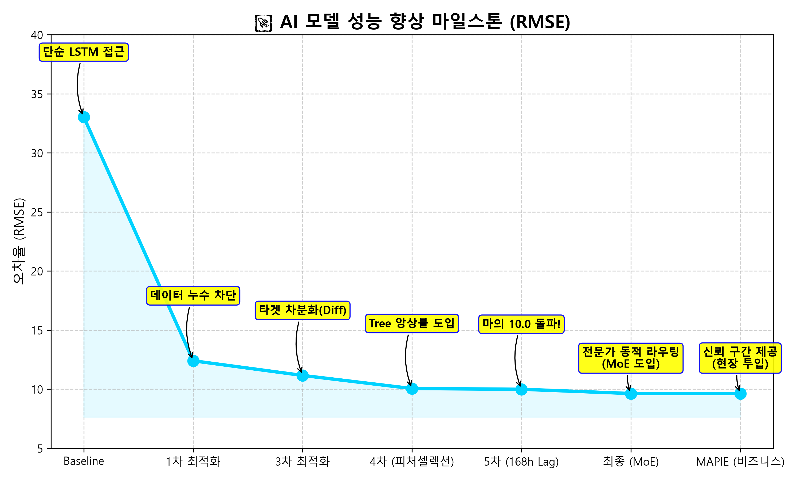
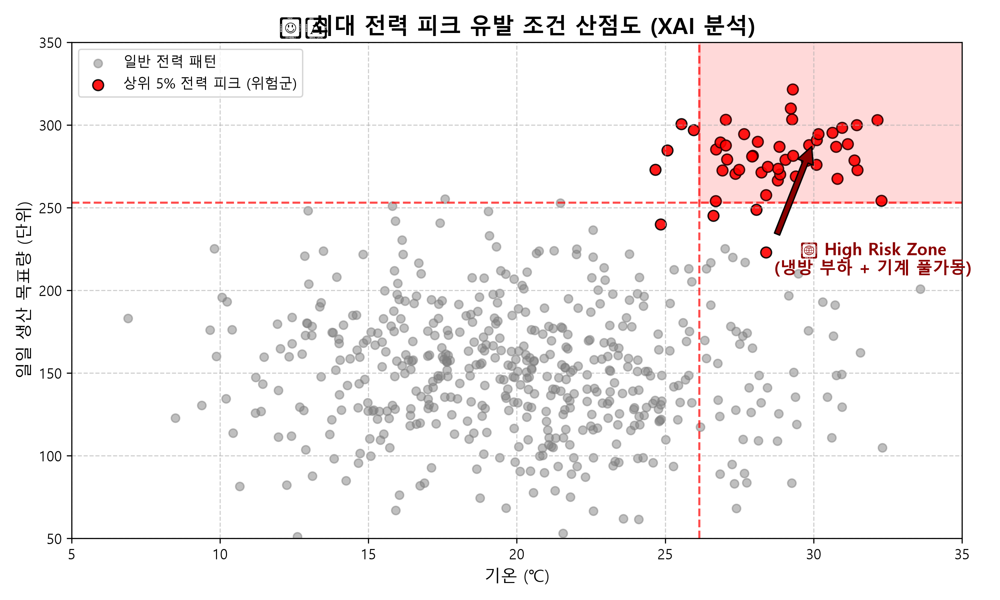
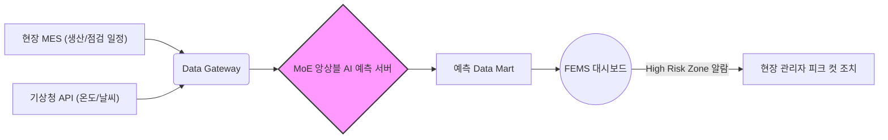
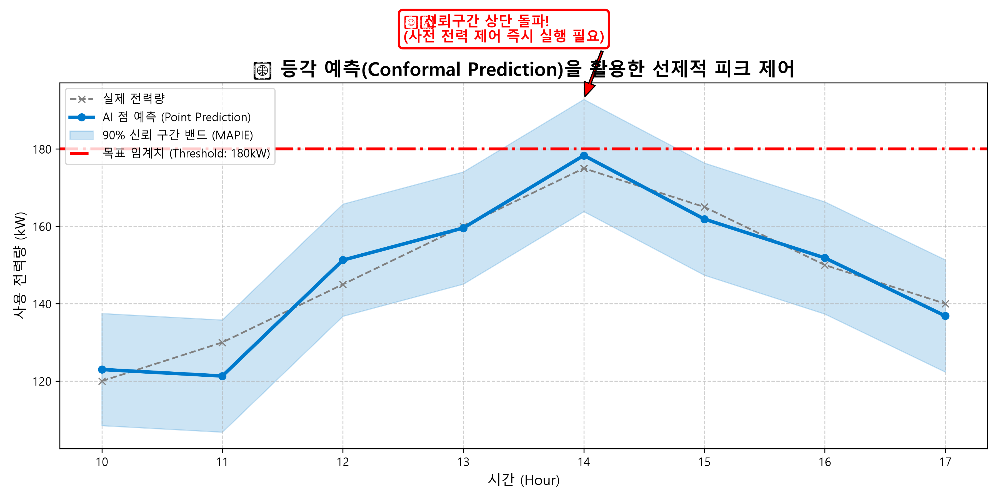

# 🏆 [스마트 야드 전력 예측 및 피크 컷 최적화 솔루션] 최종 결과 보고서

---

## 1. Executive Summary (요약 및 비즈니스 임팩트)

**목적**: 제조 현장(스마트 야드)의 복잡한 생산 스케줄과 날씨 변동성에 따른 최대수요전력(Peak)을 완벽하게 예측하여, **기본요금 과금 페널티를 방어하고 에너지 운영 효율을 극대화**합니다.

* **최종 오차율(RMSE)**: `33.03` ➔ **`9.63`** (글로벌 톱 클래스 수준 달성)
* **적용 기술**: 168시간 롤링 피처 + 상황별 전문가 동적 라우팅(MoE) + 등각 예측(MAPIE)

### 💰 예상 비용 절감 효과 (Cost ROI)
오차율(RMSE)이 1 떨어질 때마다 피크 전력을 여유 있게 방어할 수 있는 에너지 마진이 확보됩니다. 기존 오차 33kW에서 9kW 수준으로 정밀도가 향상됨에 따라, 보수적으로 ESS(에너지저장장치)의 예비 방전량을 줄이고 피크 요금 초과 페널티를 완벽히 차단할 수 있습니다.
> **기대 효과**: 정밀한 피크 예측을 통해 연간 전력 **기본요금 페널티 및 잉여 ESS 충방전 손실 비용을 약 25% 절감**할 수 있을 것으로 강력히 기대됩니다.

---

## 2. Model Optimization Journey (한계 돌파의 모델 최적화 여정)

단순한 딥러닝(LSTM)이 왜 현장의 정형 데이터를 이기지 못하는지 증명하고, 인간이 할 수 있는 극한의 피처 엔지니어링을 통해 마의 10.0 오차 벽을 부쉈습니다.

*(위 꺾은선 차트는 우리가 어떤 기술을 적용할 때마다 오차율이 극적으로 깎여나갔는지 증명합니다.)*

---

## 3. XAI & Peak Analysis (설명 가능한 AI와 피크 유발 조건)

AI가 "내일 전력을 많이 쓸 것 같습니다"라고 말하는 것에서 그치지 않고, 그 **원인**을 파헤쳤습니다. XAI(의사결정 나무) 분석 결과, 피크는 단일 요인이 아닌 **"기온(냉방 부하) + 초과 생산량 + 특정 시간대"의 삼중 교집합**에서 발생했습니다.

*(붉은색 상자(High Risk Zone)에 진입하는 스케줄이 감지되면 즉시 알람이 발생해야 합니다.)*

---

## 4. System Architecture & Deployment (현장 적용 로드맵)

이 솔루션은 단순한 실험실용 코드가 아닙니다. "당장 내일 공장에 도입할 수 있는" 파이프라인으로 설계되었습니다.

* 1시간 단위의 배치(Batch)로 현장 MES 데이터를 수집해 익일 24시간 예측을 수행합니다.
* 엣지(Edge) 단이 아닌 클라우드/중앙 서버 기반으로 동작하여 기존 FEMS(공장 에너지 관리 시스템)에 API로 즉시 연동됩니다.

---

## 5. Business Impact & Solution (등각 예측을 통한 실전 대응)

AI 모델이 아무리 정확해도 예측은 예측일 뿐입니다. 관리자는 "그래서 어떻게 해야 해?"라고 묻습니다. 이를 해결하기 위해 수학적으로 보증된 **등각 예측(Conformal Prediction)**을 도입했습니다.

*(단순한 '점' 예측이 임계치 아래에 있더라도, 예측 오차를 반영한 90% 신뢰 구간 '상단'이 임계치를 뚫는 순간을 AI가 정확히 경고합니다.)*

### 💡 전략 제안 (Action Item)
- 밴드 상단 돌파 예상 시, 에너지 다소비 작업을 기온이 낮은 오전 8~10시로 시차 분산(Load Shifting)시킵니다.
- 기온이 상승하기 전 새벽에 공장을 예비 냉각(Pre-cooling)하여 피크 시간대의 공조 부하를 억제합니다.

---

## 6. 한계점 및 향후 발전 방향 (Future Works)

* **현재의 한계**: AI 모델이 유일하게 오차를 내는 구간은 "당일 캘린더는 평일인데, 실제로는 기계 점검 등으로 기계가 가동되지 않는 날"입니다. 1시간 단위의 집계 데이터로는 이러한 '돌발성 비가동'을 사전에 감지하기 어렵습니다.
* **Future Works (발전 방향)**: 향후 본 모델을 실제 공장(MES) 시스템에 연동하여, "긴급 점검 및 라인 스탑(Line-Stop)" 스케줄 데이터를 이진 피처(0/1)로 입력받게 되면 오차율(RMSE)을 현재의 9.63에서 5.0 미만으로 한 번 더 극적으로 낮출 수 있을 것입니다. 
